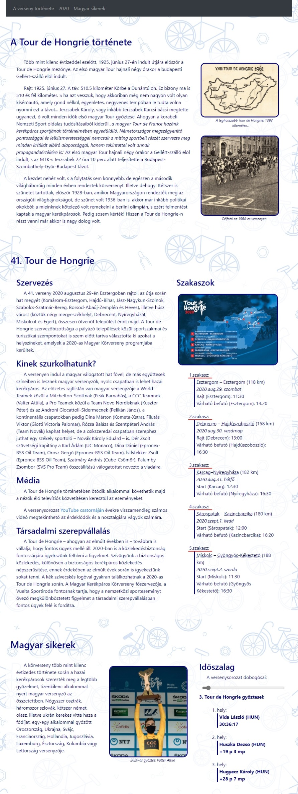

# Tour-de-Hongrie-gyakorlás

## Ez a feladat egy gyakorlófeladat volt a 2020-as érettségiről.
😎💻⌨️

> *Ma, kérem, a számítógépek királyok! Az a szomorú igazság, hogy az
> emberek fabatkát se érnek mellettük*! 

 **–Ezért kell gyakorolni!!**❣️
 
 
 
